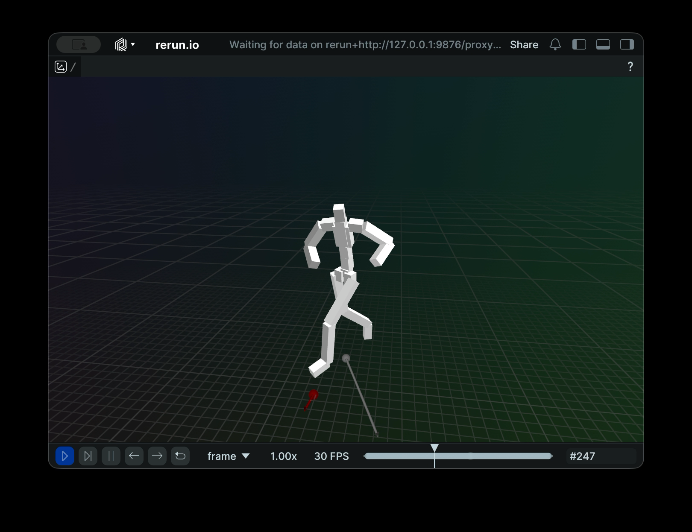

# motion-matching

a python implementation of a motion matching for character animation using 
[LAFAN1](https://github.com/ubisoft/ubisoft-laforge-animation-dataset?utm_source=chatgpt.com)
dataset.

```
uv install
uv run scripts/run.py
```


